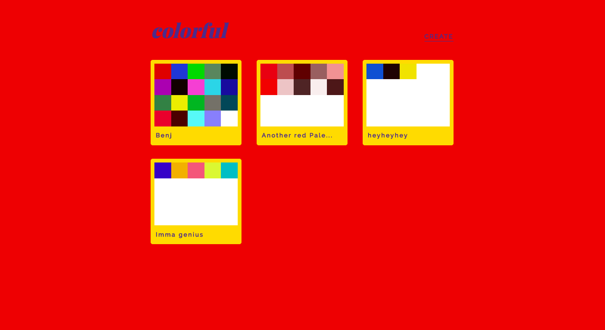
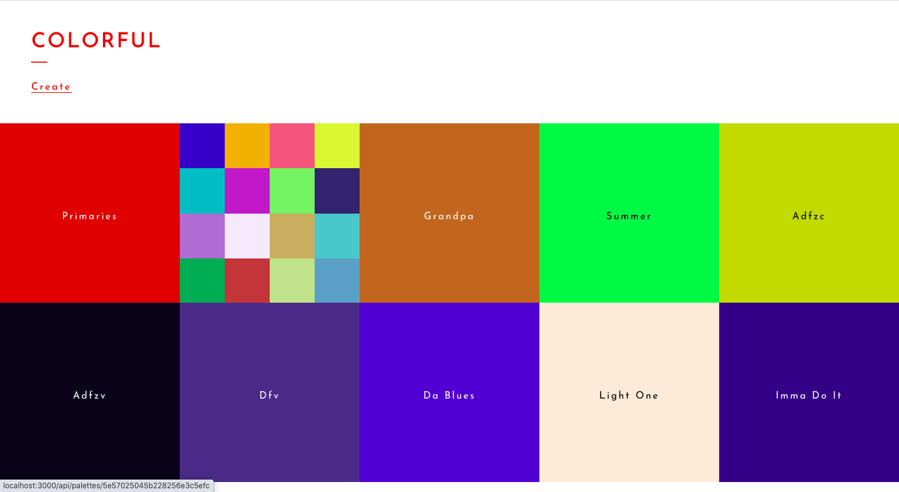
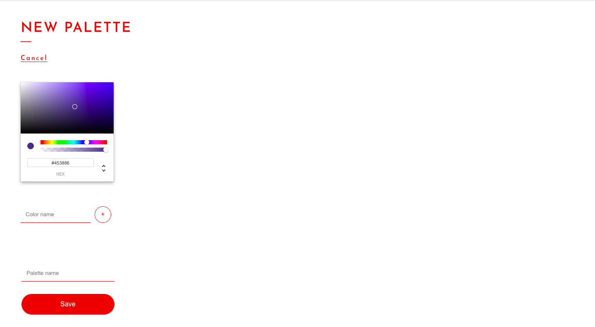
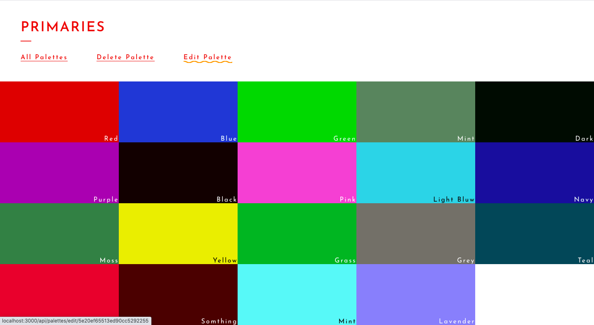
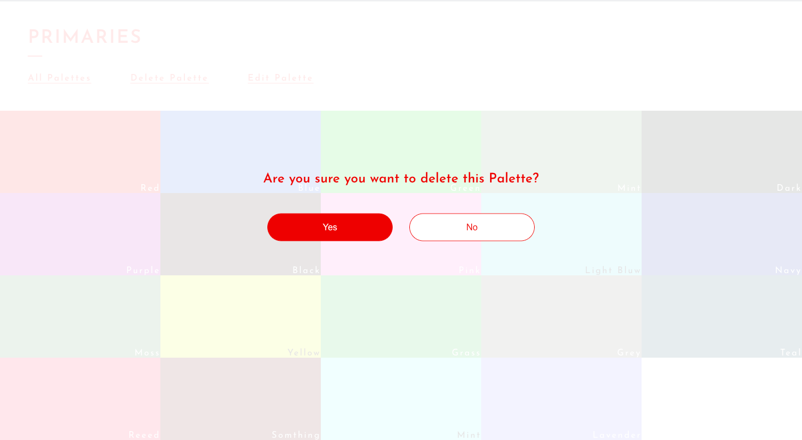
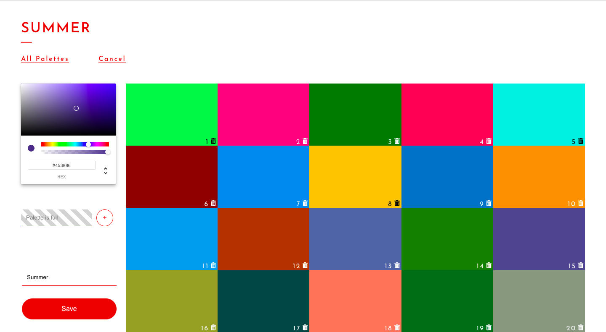

## Coloful

Colorful is a CRUD single-page-application built with React where you can create, update and delete color palettes.

## Motivation

This project was built to practice React.js, but also start diving into some back-end stuff, using the MERN stack for this project.

## Challenges

Starting this project I was excited to learn a lot of new things and get better at what I already know. Two days in I was struggling hard connecting my front-end react application to my back-end. After a lot of research I finally read up on cors, implemented that in my server and made the connection to my DB.

There was frustration and going back to re-reading documents the first weeks working on understanding the basics, like how does a server work, why use express with node, what’s a schema etc.

## Screenshots

Homepage

Hover Palette

Add new palette

Show single palette

Delete Modal

Edit Palette

## Tech/Frameworks used

- MongoDB
- Express
- React
- Node

## Features

- Manages related data through complex forms and RESTful routes.
- Designed database schema and stored data using MongoDB and mongoose.
- Uses React Portal to show modal when copying and delete confirmation.

## Credit

Hover styles where inspired by a post on CSS-tricks:

https://css-tricks.com/having-fun-with-link-hover-effects/

Design inspired by:

https://www.malikafavre.com/
